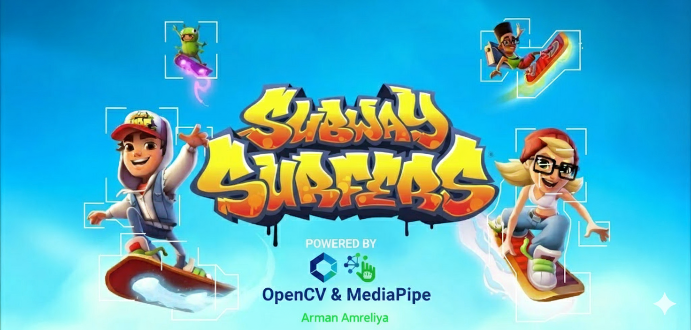

# 🎮 AR Gesture Game Controller  
*(Play Subway Surfers, SEGA, and other games using only your hand gestures!)*

Turn your webcam into a **real-time gesture-based game controller** using **OpenCV** and **MediaPipe**!  
This project lets you control games like **Subway Surfers**, **SEGA**, and others simply by moving your hand — no keyboard or controller required.  

---

## 🌟 Features at a Glance

- ✋ **Real-Time Hand Tracking** – Powered by **MediaPipe Hands** for smooth and accurate gesture detection.  
- 🧭 **5-Zone Control System** – Divide the screen into 5 intuitive control areas:
  - ⬆️ **Up Zone:** Simulates “Up Arrow”  
  - ⬇️ **Down Zone:** Simulates “Down Arrow”  
  - ⬅️ **Left Zone:** Simulates “Left Arrow”  
  - ➡️ **Right Zone:** Simulates “Right Arrow”  
  - 🟩 **Center Zone:** Neutral/safe zone (no action)
- ⌨️ **Keyboard Automation** – Uses `pyautogui` to trigger fast, discrete keypresses for responsive gameplay.  
- 🖥️ **Interactive Start Screen** – Waits for your hand to appear in the center zone, then starts with a smooth countdown.  
- ⚡ **Lag & Jitter Reduction** – Built-in cooldown system avoids double commands and ensures stability.  
- 🪟 **Resizable Window** – Adjust the OpenCV window size or move it anywhere on your screen.  

---

## 🧠 How It Works

The project captures live video from your webcam, detects hand landmarks using **MediaPipe**, and maps your palm’s position to one of five predefined zones.  
Each zone corresponds to a direction command (`Up`, `Down`, `Left`, `Right`, or `Neutral`) sent to your game via **pyautogui**.  

---

## 🚀 Getting Started

### 1. Prerequisites
Ensure you have **Python 3.x** installed on your system.

---

### 2. Installation

Clone this repository and install the required libraries:

# Clone the repository
git clone https://github.com/your-username/AR_Gesture-Game-CV.git
cd AR_Gesture-Game-CV

# Install dependencies
pip install opencv-python mediapipe numpy pyautogui

---
⭐ If you enjoyed this project, give it a star on GitHub and share your gameplay videos!
Let’s make gaming more hands-free 🤚🎮
